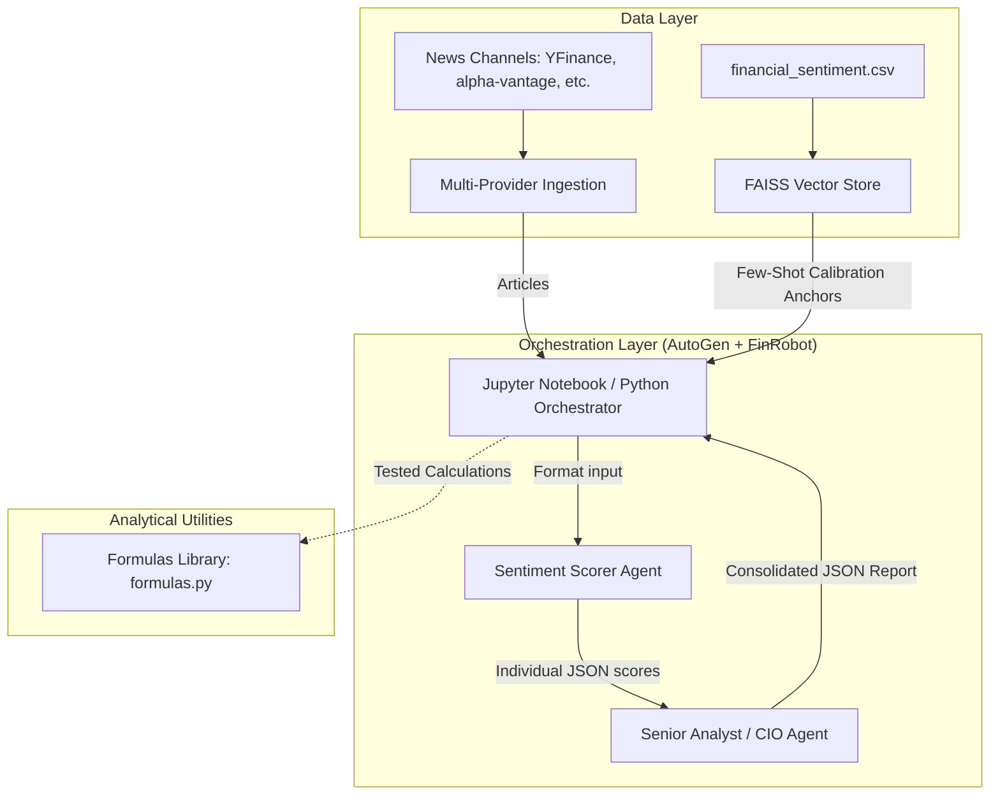
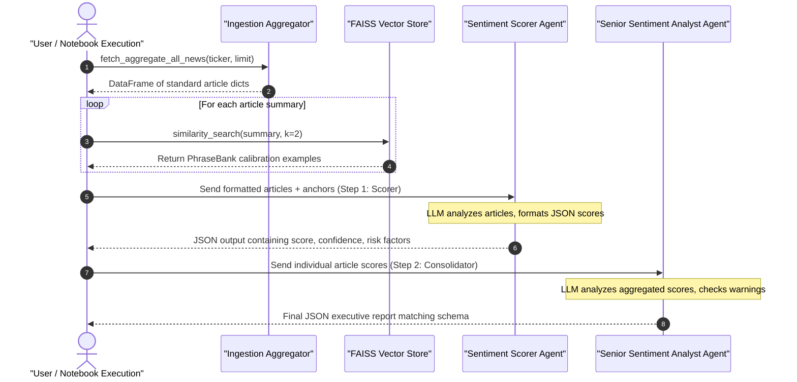

# SentinelAlpha: Multi-Provider Ingestion & Few-Shot Sentiment Scoring Pipeline

This sub-project implements a modular financial news ingestion and sentiment analysis engine. It consolidates news across multiple active feeds, matches semantic calibration anchors via a local FAISS vector database, and orchestrates a collaborative two-agent scoring workflow.

---

## 🏛️ System Architecture

The active system runs inside standard Python/Jupyter execution environments, utilizing **AutoGen** and **FinRobot** workflows, mapped through the following design:



---

## 📂 Project Directory Structure

All implemented code and assets are located inside the `sentiment/` directory:

| Directory / File | Description | Reference Link |
| :--- | :--- | :--- |
| **`functions/aggregator/`** | Standardized news fetcher, standardizing articles across 11 sources. | [aggregator.py](file:///d:/PartnaStudio/sentinel/stack/FinRobot-IntentChain/sentiment/functions/aggregator/aggregator.py) |
| **`functions/tools/`** | Agent definition factories, prompt loaders, and custom response/chat behaviors. | [agents.py](file:///d:/PartnaStudio/sentinel/stack/FinRobot-IntentChain/sentiment/functions/tools/agents.py) <br> [custom_reply.py](file:///d:/PartnaStudio/sentinel/stack/FinRobot-IntentChain/sentiment/functions/tools/custom_reply.py) <br> [prepare_articles.py](file:///d:/PartnaStudio/sentinel/stack/FinRobot-IntentChain/sentiment/functions/tools/prepare_articles.py) |
| **`functions/utils/`** | Structured utilities package divided into sub-packages:<br>- **`common/`**: Indexing, config, data cleaning<br>- **`math/`**: Formula math and formulas tests<br>- **`logging/`**: Audit, compliance, pipeline logs<br>- **`macro/`**: Scrapers, calendar, surprise MCP<br>- **`news/`**: Orchestrator, news helpers | [common/](file:///d:/PartnaStudio/sentinel/stack/FinRobot-IntentChain/sentiment/functions/utils/common/) <br> [math/](file:///d:/PartnaStudio/sentinel/stack/FinRobot-IntentChain/sentiment/functions/utils/math/) <br> [logging/](file:///d:/PartnaStudio/sentinel/stack/FinRobot-IntentChain/sentiment/functions/utils/logging/) <br> [macro/](file:///d:/PartnaStudio/sentinel/stack/FinRobot-IntentChain/sentiment/functions/utils/macro/) <br> [news/](file:///d:/PartnaStudio/sentinel/stack/FinRobot-IntentChain/sentiment/functions/utils/news/) |
| **`prompts/`** | Standalone instruction prompt configuration templates for Scorer and CIO agents. | [sentiment_prompt.txt](file:///d:/PartnaStudio/sentinel/stack/FinRobot-IntentChain/sentiment/prompts/sentiment_prompt.txt) <br> [cio_prompt.txt](file:///d:/PartnaStudio/sentinel/stack/FinRobot-IntentChain/sentiment/prompts/cio_prompt.txt) |
| **`schema_json/`** | JSON schema validation contracts determining incoming structures and outgoing report payloads. | [scorer_schema.json](file:///d:/PartnaStudio/sentinel/stack/FinRobot-IntentChain/sentiment/schema_json/scorer_schema.json) <br> [sentiment_schema.json](file:///d:/PartnaStudio/sentinel/stack/FinRobot-IntentChain/sentiment/schema_json/sentiment_schema.json) <br> [cio_output_schema.json](file:///d:/PartnaStudio/sentinel/stack/FinRobot-IntentChain/sentiment/schema_json/cio_output_schema.json) |
| **`tutorials/`** | Interactive Jupyter Notebooks showing baseline execution, modular utilities, and nested-chat delegation. | [tutorials/](file:///d:/PartnaStudio/sentinel/stack/FinRobot-IntentChain/sentiment/tutorials/) |
| **`NEXT_STEPS.md`** | Roadmap outlining future integrations such as database storage tables, RL rebalancing, and compliance gateways. | [NEXT_STEPS.md](file:///d:/PartnaStudio/sentinel/stack/FinRobot-IntentChain/sentiment/NEXT_STEPS.md) |

---

## 🔄 Ingestion & Scoring Flow

The collaborative multi-agent execution follows a structured, step-by-step pipeline:



---

## 🧮 Offline Mathematical Formulas Library

A standalone math helper module is implemented in [formulas.py](file:///d:/PartnaStudio/sentinel/stack/FinRobot-IntentChain/sentiment/functions/utils/math/formulas.py) and verified by unit tests in [test_formulas.py](file:///d:/PartnaStudio/sentinel/stack/FinRobot-IntentChain/sentiment/functions/utils/math/test_formulas.py). These functions are prepared for future database processing and rebalancing integrations:

1. **Confidence-Weighted Raw Sentiment ($S_{\text{raw}}$)**:
   Averages raw sentiment scores $s_i \in [-1, 1]$ weighted by their prediction confidence values $c_i$:
   $$S_{\text{raw}, j, t} = \frac{\sum_{i=1}^{M_j} s_{i} \cdot c_{i}}{\sum_{i=1}^{M_j} c_{i}}$$

2. **Macro Surprise Index ($\mathcal{S}_t$)**:
   Measures rolling macroeconomic surprises, scaled by standard deviation and event tier weights:
   $$\mathcal{S}_t = \omega_{\text{static}} \times \left| \frac{\text{Actual}_t - \text{Consensus}_t}{\sigma_{\text{historical}}} \right|$$

3. **Effective Ticker Sentiment**:
   Adjusts raw sentiment using macroeconomic surprise and sector sensitivities:
   $$\text{Effective Sentiment}_{j, t} = S_{\text{raw}, j, t} \times (1 + \beta_j \cdot \mathcal{S}_t)$$

4. **Portfolio Sentiment**:
   Aggregates constituents' effective sentiment based on current target weights:
   $$\mathcal{S}_{\text{portfolio}, t} = \sum_{j=1}^{n} w_{j, t} \times \text{Effective Sentiment}_{j, t}$$

5. **Portfolio Active Drift**:
   Computes the active deviation distance ($L1$-norm) of the holdings:
   $$\text{Drift}_t = \sum_{j=1}^{n} |w_{\text{actual}, j, t} - w_{\text{target}, j, t}|$$

---

## 🛠️ Installation & Setup

1. **Configure Environment Variables**:
   Create a `.env.local` file inside the `sentiment` folder (matching the structure of `sentiment/.env.example`):
   ```env
   HUGGINGFACE_API_KEY = "your-hf-token"
   HUGGINGFACE_MODEL_NAME_FEATHERLESS = "curiousily/Llama-3-8B-Instruct-Finance-RAG"
   HUGGINGFACE_BASE_URL = "https://router.huggingface.co/v1"

   NVIDIA_EMBEDDING_MODEL = "nvidia/nv-embed-v1"
   NVIDIA_API_ENDPOINT = "https://integrate.api.nvidia.com/v1"
   NVIDIA_API_KEY = "your-nvidia-key"
   ```

2. **Initialize Local Virtual Environment**:
   ```bash
   cd sentiment
   python -m venv venv
   # On Windows:
   .\venv\Scripts\activate
   # On Unix/macOS:
   source venv/bin/activate
   pip install -r requirements.txt
   ```

3. **Verify Installation**:
   Run the offline formulas test suite to confirm mathematical utilities execute successfully:
   ```bash
   # Run from the project root using pytest
   pytest sentiment/functions/utils/math/test_formulas.py
   ```

4. **Running the Pipelines**:
   Open a Jupyter notebook server and run:
   - **`tutorials/llama3_news_delegation.ipynb`**: Flagship two-agent nested chat execution.
   - **`tutorials/llama3_news.ipynb`**: Modular sequential execution.
