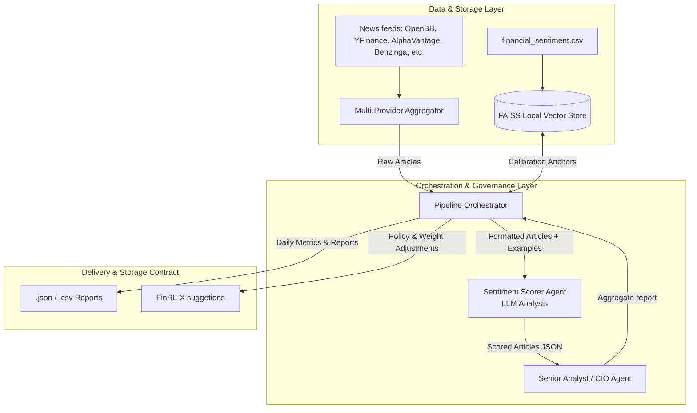
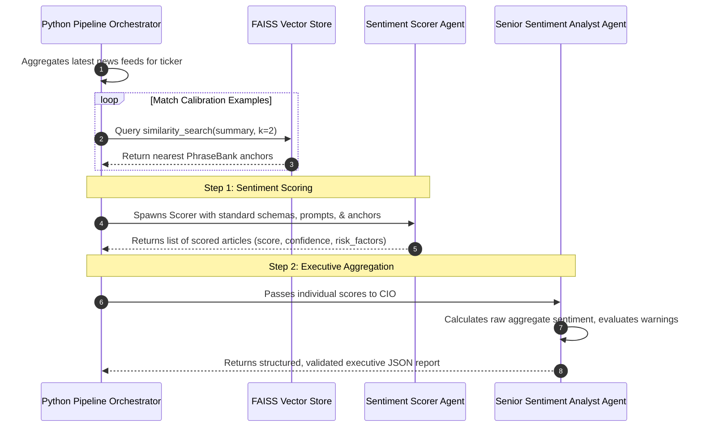

# 🚀 Apple (AAPL) Multi-Provider Sentiment Analysis & Governance Pipeline

This sub-project implements a production-grade, modular financial sentiment analysis engine. It consolidates financial news across 11 different feeds (via OpenBB Platform and custom official APIs), maps similarity-matched calibration anchors through a local FAISS vector store, performs deep agentic sentiment scoring, and executes aggregated reporting under policy compliance constraints.

---

## 🗺️ System Architecture

The project has transitioned from monolithic notebook scripts into a clean, multi-layered architecture separating raw data ingestion, multi-agent orchestration, and output report structure contracts.



---

## 📂 Project Directory Structure

Below is an overview of the code organization:

| Directory / File | Description | Reference Link |
| :--- | :--- | :--- |
| **`functions/aggregator/`** | Multi-channel news fetcher, standardizing titles, dates, excerpts, and bodies from 11 sources. | [aggregator.py](file:///d:/PartnaStudio/sentinel/stack/FinRobot-IntentChain/sentiment/functions/aggregator/aggregator.py) |
| **`functions/tools/`** | Agent definition factories, prompt loaders, and custom response/chat behaviors. | [agents.py](file:///d:/PartnaStudio/sentinel/stack/FinRobot-IntentChain/sentiment/functions/tools/agents.py) <br> [custom_reply.py](file:///d:/PartnaStudio/sentinel/stack/FinRobot-IntentChain/sentiment/functions/tools/custom_reply.py) <br> [prepare_articles.py](file:///d:/PartnaStudio/sentinel/stack/FinRobot-IntentChain/sentiment/functions/tools/prepare_articles.py) |
| **`functions/utils/`** | Helpers for FAISS database indexing, API environment configurations, and content cleaning. | [build.py](file:///d:/PartnaStudio/sentinel/stack/FinRobot-IntentChain/sentiment/functions/utils/build.py) <br> [config.py](file:///d:/PartnaStudio/sentinel/stack/FinRobot-IntentChain/sentiment/functions/utils/config.py) <br> [read_and_clean.py](file:///d:/PartnaStudio/sentinel/stack/FinRobot-IntentChain/sentiment/functions/utils/read_and_clean.py) |
| **`prompts/`** | Standalone instruction prompt configuration templates for Scorer and CIO agents. | [sentiment_prompt.txt](file:///d:/PartnaStudio/sentinel/stack/FinRobot-IntentChain/sentiment/prompts/sentiment_prompt.txt) <br> [cio_prompt.txt](file:///d:/PartnaStudio/sentinel/stack/FinRobot-IntentChain/sentiment/prompts/cio_prompt.txt) |
| **`schema_json/`** | JSON schema validation contracts determining incoming structures and outgoing report payloads. | [scorer_schema.json](file:///d:/PartnaStudio/sentinel/stack/FinRobot-IntentChain/sentiment/schema_json/scorer_schema.json) <br> [sentiment_schema.json](file:///d:/PartnaStudio/sentinel/stack/FinRobot-IntentChain/sentiment/schema_json/sentiment_schema.json) <br> [cio_output_schema.json](file:///d:/PartnaStudio/sentinel/stack/FinRobot-IntentChain/sentiment/schema_json/cio_output_schema.json) |
| **`tutorials/`** | Interactive Jupyter Notebooks showing baseline execution, modular utilities, and nested-chat delegation. | [tutorials/](file:///d:/PartnaStudio/sentinel/stack/FinRobot-IntentChain/sentiment/tutorials/) |
| **`NEXT_STEPS.md`** | High-level roadmap outlining portfolio rebalancing suggestions, storage structures, and risk factors integration. | [NEXT_STEPS.md](file:///d:/PartnaStudio/sentinel/stack/FinRobot-IntentChain/sentiment/NEXT_STEPS.md) |

---

## ⚙️ Process Flow & Core Math



### A. Raw Sentiment Score ($S_{\text{raw}, j, t}$)
For a given ticker $j$, raw sentiment scores $s_i \in [-1, 1]$ are averaged over the last 24 hours, weighted by their confidence parameters $c_i$:

$$S_{\text{raw}, j, t} = \frac{\sum_{i=1}^{M_j} s_{i} \cdot c_{i}}{\sum_{i=1}^{M_j} c_{i}}$$

### B. Effective Sentiment Score ($\text{Effective Sentiment}_{j, t}$)
To translate raw news trends into portfolio indicators, rolling macroeconomic surprises ($\mathcal{S}_t$) are scaled by sector beta sensitivities ($\beta_j$) and added as an overlay:

$$\text{Effective Sentiment}_{j, t} = S_{\text{raw}, j, t} \times (1 + \beta_j \cdot \mathcal{S}_t)$$

---

## 🛠️ Installation & Setup

1. **Clone & Set Up Environment**:
   Ensure you have configured a `.env.local` file inside the `sentiment` folder (refer to `sentiment/.env.example`):
   ```env
   # LLM endpoints config
   HUGGINGFACE_API_KEY = "your-hf-token"
   HUGGINGFACE_MODEL_NAME_FEATHERLESS = "curiousily/Llama-3-8B-Instruct-Finance-RAG"
   HUGGINGFACE_BASE_URL = "https://router.huggingface.co/v1"

   # Vector database embeddings config
   NVIDIA_EMBEDDING_MODEL = "nvidia/nv-embed-v1"
   NVIDIA_API_ENDPOINT = "https://integrate.api.nvidia.com/v1"
   NVIDIA_API_KEY = "your-nvidia-key"
   ```

2. **Initialize Local Virtual Environment**:
   From the project root:
   ```bash
   cd sentiment
   python -m venv venv
   # On Windows:
   .\venv\Scripts\activate
   # On Unix/macOS:
   source venv/bin/activate
   pip install -r requirements.txt
   ```

3. **Running the Tutorials**:
   - Access the Jupyter workspace inside `sentiment/tutorials/`.
   - **`llama3_news_delegation.ipynb`**: Demonstrates the flagship agent-to-agent nested delegation chat where the Scorer and CIO collaborate to produce the reports.
   - **`llama3_news.ipynb`**: Implements sequential two-agent workflows utilizing the refactored code modules.
